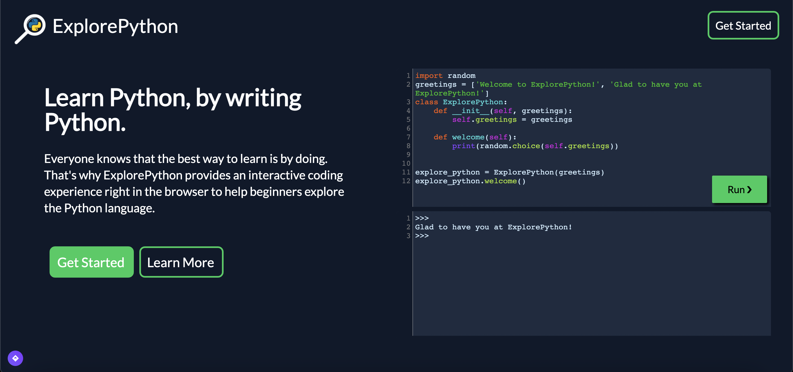

# ExplorePython
## Learn Python, by writing Python.
ExplorePython is a fun, interactive way to learn and explore the Python language. 
With bite sized mini lessons on topics from variables to Object Oriented Programming, 
ExplorePython provides the tools that every budding developer needs to succeed. 
After each lesson, you'll get the chance to test your knowledge by writing and running code relating to the topic you just learned. 
You then have your solution evaluated on the spot before moving on.

### Link to Website
https://explorepython.dev

ExplorePython is run on a flask server. 
To host locally, just clone the repository, install the requirements, and run `app.py`. 
